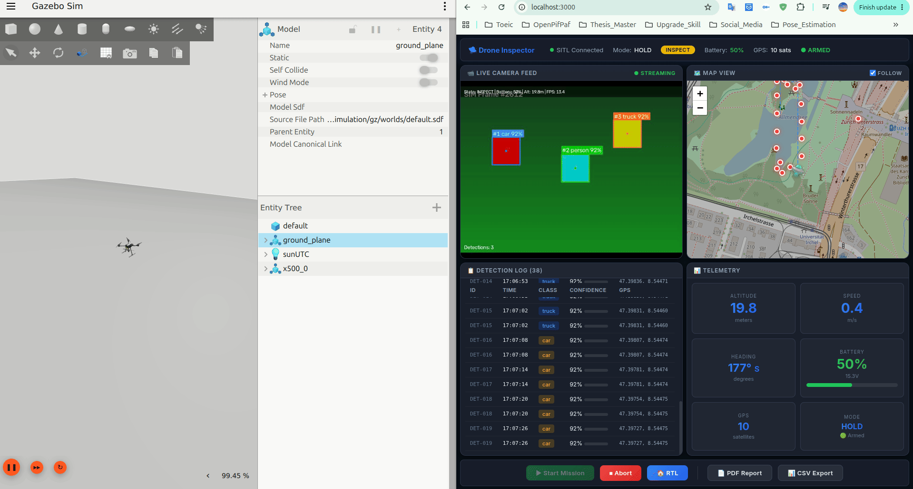

# 🛸 Drone Inspector — Autonomous Inspection Drone MVP

> **Simulation-Only** — PX4 SITL + Gazebo Harmonic + ROS 2 Jazzy | No hardware required

An autonomous inspection drone system built on PX4 SITL with computer vision
(YOLOv8 + ByteTrack), an event-driven mission state machine, and a real-time
operator dashboard. Everything runs in simulation.



---

## 🏗️ Architecture

### System Overview

```
┌─────────────────────────────────────────────────────────────────┐
│                        SIMULATION LAYER                         │
│   PX4 SITL  ◄──MAVLink──►  Gazebo Harmonic  (UDP :14540)       │
└────────────────────┬────────────────────────────────────────────┘
                     │ MAVSDK-Python (gRPC)
┌────────────────────▼────────────────────────────────────────────┐
│                         BRIDGE LAYER                            │
│   MAVLinkBridge (DroneConnector)  ·  FlightCommands             │
│   TelemetryCollector  ·  Connection health + auto-reconnect      │
└────────┬──────────────────────────────────────┬─────────────────┘
         │ Commands / Telemetry                  │ Telemetry frames
┌────────▼───────────────────────┐   ┌──────────▼─────────────────┐
│         AUTONOMY LAYER         │   │       STREAMING LAYER       │
│  MissionStateMachine           │   │  Gazebo Camera              │
│    → PREFLIGHT → TAKEOFF       │   │    ↓ GStreamer / TestPattern │
│    → SEARCH → DETECT           │   │  YOLOv8 Detection           │
│    → INSPECT → LOG → RTL       │   │    ↓ ByteTrack Tracking     │
│  SafetyMonitor (battery,       │   │  GPS Geotagging             │
│    geofence, altitude)         │   │    ↓ JPEG Overlay           │
│  WaypointPlanner (strategies)  │   │  VideoServer → WebSocket    │
└────────┬───────────────────────┘   └──────────┬──────────────────┘
         │ Detections / State                    │ MJPEG frames
┌────────▼───────────────────────────────────────▼─────────────────┐
│                       DASHBOARD LAYER                            │
│  FastAPI Backend (port 8000)                                     │
│    REST: mission · telemetry · detections · reports              │
│    WebSocket: /ws/telemetry  /ws/detections  /ws/video           │
│  React + Vite Frontend (port 3000)                               │
│    Live Map · Camera Feed · Detection Log · Telemetry · Reports  │
└──────────────────────────────────────────────────────────────────┘
```

### Design Patterns

| Pattern | Where Applied |
|---------|---------------|
| **Strategy** | Pluggable search patterns — `LawnmowerPattern`, `ExpandingSquarePattern` |
| **Observer** | `EventBus` decouples telemetry, detection, and state-change events |
| **Chain of Responsibility** | Composable safety rules — `BatteryRule`, `GeofenceRule`, `AltitudeRule` |
| **Factory** | `CameraFactory`, `AppFactory` — config-driven, no hard-coded wiring |
| **State Machine** | `MissionStateMachine` with declarative transitions via `transitions` lib |
| **Dependency Inversion** | All consumers depend on ABCs (`DroneConnector`, `FlightController`, ...) |

### Layer Responsibilities

| Layer | Modules | Responsibility |
|-------|---------|----------------|
| **Core** | `core/types.py`, `core/interfaces.py`, `core/events.py` | Shared DTOs, ABCs, EventBus — no dependencies |
| **Bridge** | `bridge/mavlink_bridge.py`, `bridge/commands.py` | PX4 communication, gRPC health, auto-reconnect |
| **Perception** | `perception/camera.py`, `detector.py`, `tracker.py`, `geotagging.py` | Vision pipeline from frame to geo-tagged detection |
| **Autonomy** | `mission/state_machine.py`, `executor.py`, `safety.py` | Mission orchestration and safety monitoring |
| **Streaming** | `streaming/video_server.py`, `overlay.py` | MJPEG WebSocket broadcast with overlay rendering |
| **Dashboard** | `dashboard/backend/`, `dashboard/frontend/` | Operator UI — REST + WebSocket + React |

> 📄 Full architecture docs with UML diagrams: [docs/architecture.md](docs/architecture.md)

---

## 🚀 Quick Start

### Prerequisites

| Requirement | Version | Notes |
|-------------|---------|-------|
| Ubuntu | 22.04 LTS | Required for PX4 SITL + Gazebo |
| Miniconda / Conda | any | Environment management |
| Python | ≥ 3.10 | Installed via conda |
| Node.js | ≥ 18 | For dashboard frontend |
| PX4 Autopilot | v1.15+ | Installed by `setup_env.sh` |
| Gazebo Harmonic | 8.x | Installed by PX4 setup |

### 1. Setup Environment

```bash
# 1. Create and activate the conda environment
conda create -n dronepx4 python=3.10 -y
conda activate dronepx4

# 2. Install PX4 SITL, Gazebo, and Node.js via the setup script
chmod +x scripts/setup_env.sh
./scripts/setup_env.sh

# 3. Install Python dependencies
pip install -r requirements.txt

# 4. Install frontend dependencies
cd src/dashboard/frontend && npm install && cd -
```

> **Note:** The setup script installs PX4-Autopilot and Gazebo Harmonic system-wide.
> The conda environment handles all Python dependencies. Re-run `conda activate dronepx4`
> in every new terminal before starting any Python process.

### 2. Launch PX4 SITL

```bash
# Terminal 1: Start PX4 SITL + Gazebo
./scripts/launch_sitl.sh
```

### 3. Run Mission

```bash
# Make sure conda env is active first
conda activate dronepx4

# Terminal 2: Execute autonomous mission (CLI mode)
python scripts/run_mission.py

# With custom config:
python scripts/run_mission.py --config config/vehicle/sim_config.yaml
```

### 4. Launch Dashboard (optional)

```bash
conda activate dronepx4

# Terminal 3: Start backend
cd src/dashboard/backend && uvicorn main:app --reload --port 8000

# Terminal 4: Start frontend
cd src/dashboard/frontend && npm run dev
# Open http://localhost:3000 — use the ▶ Start Mission button
```

---

## 📋 Mission State Machine

```
IDLE → PREFLIGHT → TAKEOFF → SEARCH → DETECT → INSPECT → LOG → RTL → LANDED
                                ↑                           |
                                └───── more waypoints ──────┘
```

| State | Description |
|-------|-------------|
| **PREFLIGHT** | Check GPS fix, vehicle health, connection |
| **TAKEOFF** | Arm → takeoff to configured altitude |
| **SEARCH** | Navigate waypoints with continuous perception |
| **DETECT** | Confirm detection over consecutive frames |
| **INSPECT** | Hover over target, capture imagery |
| **LOG** | Geotag detection, decide resume/RTL |
| **RTL** | Return to launch position |
| **ABORT** | Safety-triggered → immediate RTL |

Safety monitoring runs continuously: battery, geofence, altitude, connection → auto-RTL.

---

## 🛠️ Tech Stack

| Component | Technology |
|-----------|-----------|
| Flight Controller | PX4 v1.15+ (SITL) |
| Simulator | Gazebo Harmonic |
| ROS 2 | Jazzy Jalisco |
| Flight Control | MAVSDK-Python |
| Object Detection | YOLOv8 (Ultralytics) |
| Object Tracking | ByteTrack (custom impl) |
| Video Streaming | OpenCV + WebSocket MJPEG |
| Dashboard Backend | FastAPI + WebSocket |
| Dashboard Frontend | React + Vite + Leaflet |
| Reports | ReportLab (PDF) + CSV |
| Language | Python 3.10+ |

> **Connection robustness**: The backend auto-kills orphaned `mavsdk_server` processes on port 50051 before each connect attempt, retries with exponential backoff (3 attempts), and recovers telemetry streams after transient gRPC failures.

---

## 📁 Project Structure

```
DronePX4/
├── src/
│   ├── core/                   # Foundation — no dependencies on other layers
│   │   ├── types.py            #   DTOs: Position, TelemetryFrame, GeotaggedDetection …
│   │   ├── interfaces.py       #   ABCs: DroneConnector, FlightController, CameraSource …
│   │   ├── geo.py              #   GPS math: haversine, offset_gps
│   │   └── events.py           #   EventBus (Observer pattern)
│   │
│   ├── bridge/                 # PX4 communication
│   │   ├── mavlink_bridge.py   #   DroneConnector impl — MAVSDK, auto-reconnect
│   │   ├── commands.py         #   FlightController impl — arm/takeoff/goto/RTL
│   │   └── telemetry.py        #   TelemetryCollector
│   │
│   ├── perception/             # Computer vision pipeline
│   │   ├── camera.py           #   CameraSource: GStreamer, VideoFile, TestPattern
│   │   ├── detector.py         #   ObjectDetector impl (YOLOv8)
│   │   ├── tracker.py          #   ObjectTracker impl (ByteTrack)
│   │   └── geotagging.py       #   GPS geotagging of detections
│   │
│   ├── mission/                # Autonomy
│   │   ├── state_machine.py    #   MissionStateMachine (transitions lib)
│   │   ├── executor.py         #   MissionExecutor — state handler methods
│   │   ├── safety.py           #   SafetyMonitor + Rules (Chain of Responsibility)
│   │   └── waypoint_planner.py #   PatternRegistry + Strategy implementations
│   │
│   ├── streaming/              # Video output
│   │   ├── video_server.py     #   WebSocket MJPEG broadcaster
│   │   └── overlay.py          #   Detection bounding-box overlay renderer
│   │
│   ├── dashboard/
│   │   ├── backend/            # FastAPI application
│   │   │   ├── main.py         #   App entry point + lifespan
│   │   │   ├── dependencies.py #   AppContainer (typed DI singleton)
│   │   │   ├── routers/        #   mission · telemetry · detections · video · reports
│   │   │   ├── models/         #   Pydantic request/response schemas
│   │   │   └── api/reports.py  #   PDF report generator (ReportLab)
│   │   └── frontend/           #   React + Vite + Leaflet
│   │
│   ├── factory.py              # AppFactory — wires all subsystems from config
│   └── utils/                  # Config loader (YAML), structured logging
│
├── tests/unit/                 # 66 unit tests
│   ├── test_core.py            #   EventBus, geo utilities
│   ├── test_waypoint_planner.py#   Strategy pattern + PatternRegistry
│   ├── test_tracker.py         #   ByteTrack ObjectTracker
│   ├── test_safety.py          #   Chain of Responsibility rules
│   └── test_geotagging.py      #   GPS projection
│
├── config/                     # sim_config.yaml, PX4 params, Gazebo worlds
├── docs/                       # architecture.md, runbook.md, setup_guide.md
├── scripts/                    # launch_sitl.sh · setup_env.sh · run_mission.py
└── docker/                     # Docker Compose (px4-sitl, backend, frontend)
```

---

## 🔌 API Reference

### REST Endpoints

| Method | Endpoint | Description |
|--------|----------|-------------|
| `POST` | `/api/mission/start` | Start inspection mission |
| `POST` | `/api/mission/abort` | Abort → RTL |
| `POST` | `/api/mission/rtl` | Return to launch |
| `GET`  | `/api/mission/status` | Mission state, progress, battery |
| `GET`  | `/api/status` | System health (connection, GPS, uptime) |
| `GET`  | `/api/detections` | All geotagged detection events |
| `GET`  | `/api/snapshot` | Single JPEG frame |
| `GET`  | `/api/report/csv` | Download CSV detection report |
| `GET`  | `/api/report/pdf` | Download PDF mission report |

### WebSocket Endpoints

| Endpoint | Description | Data |
|----------|-------------|------|
| `/ws/telemetry` | Real-time telemetry @ 10 Hz | JSON — altitude, speed, battery, GPS, heading, flight mode |
| `/ws/detections` | Detection events as they occur (resets between missions) | `DetectionEvent` JSON |
| `/ws/video` | MJPEG video with detection overlays | Binary JPEG frames @ 15 FPS |

### Reports

Both reports are accessible via the dashboard buttons or directly via HTTP:

| Endpoint | Notes |
|----------|-------|
| `GET /api/report/csv` | Always returns a valid CSV; includes an informational row when empty |
| `GET /api/report/pdf` | Includes Vehicle Telemetry section (position, battery, GPS, flight mode) |

---

## 🧩 Extending the System

### Add a New Search Pattern (Strategy)
```python
from src.core.interfaces import SearchPatternStrategy
from src.mission.waypoint_planner import PatternRegistry

class SpiralPattern(SearchPatternStrategy):
    @property
    def name(self) -> str: return "spiral"
    def generate(self, config: dict) -> list:
        # ... your waypoint generation logic ...
        pass

PatternRegistry.register(SpiralPattern())
```

### Add a New Safety Rule (Chain of Responsibility)
```python
from src.core.interfaces import SafetyRule

class WindSpeedRule(SafetyRule):
    @property
    def name(self) -> str: return "wind_speed"
    def evaluate(self, telemetry) -> SafetyAction:
        # ... your safety logic ...
        pass

monitor.add_rule(WindSpeedRule())
```

### Swap the Detector Backend (Dependency Inversion)
```python
from src.core.interfaces import ObjectDetector

class TensorRTDetector(ObjectDetector):
    def load(self) -> None: ...
    def detect(self, frame) -> list: ...
    @property
    def avg_inference_ms(self) -> float: ...

# Just pass it in — no other code changes needed
sm = MissionStateMachine(detector=TensorRTDetector(), ...)
```

---

## ⚙️ Configuration

Edit `config/vehicle/sim_config.yaml` to customize:

| Section | Parameters |
|---------|-----------|
| `connection` | MAVSDK address (`udp://:14540`) |
| `camera` | Source type, resolution, FPS, HFOV |
| `perception` | Model path, device, confidence threshold, target classes |
| `mission` | Search pattern, area, altitude, spacing |
| `safety` | Geofence radius, max altitude, battery thresholds |
| `dashboard` | Telemetry rate, video quality, port |

---

## 🧪 Testing

```bash
conda activate dronepx4

# Run all unit tests (66 tests)
python -m pytest tests/unit/ -v

# Run specific test module
python -m pytest tests/unit/test_safety.py -v

# Run with coverage
python -m pytest tests/unit/ --cov=src --cov-report=term-missing
```

---

## 📄 License

MIT
