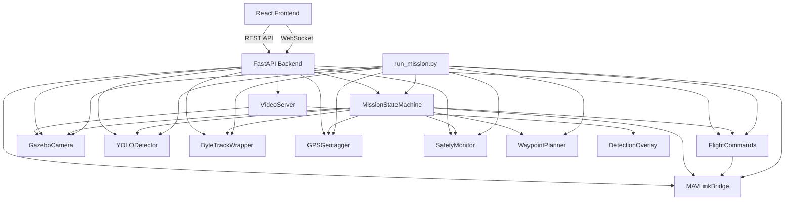

# Architecture Overview

## System Diagram

```
┌─────────────────────────────────────────────────────────────────────┐
│                         HOST MACHINE                                │
│                                                                     │
│  ┌───────────────┐     UDP :14540      ┌──────────────────────┐    │
│  │  PX4 SITL     │ ◄─────────────────► │  MAVSDK-Python       │    │
│  │  (px4_sitl)   │                     │  (mavlink_bridge.py)  │    │
│  └───────┬───────┘                     └──────────┬───────────┘    │
│          │                                        │                 │
│          │ Shared Memory / gz-transport            │                 │
│          ▼                                        ▼                 │
│  ┌───────────────┐                     ┌──────────────────────┐    │
│  │  Gazebo       │  Camera Topic ───►  │  Perception Pipeline │    │
│  │  Harmonic     │                     │  ┌────────────────┐  │    │
│  │  (Simulator)  │                     │  │ GazeboCamera   │  │    │
│  │               │                     │  │    ▼           │  │    │
│  │  • Physics    │                     │  │ YOLOv8 Det.    │  │    │
│  │  • Sensors    │                     │  │    ▼           │  │    │
│  │  • Rendering  │                     │  │ ByteTrack      │  │    │
│  └───────────────┘                     │  │    ▼           │  │    │
│                                        │  │ GPS Geotagger  │  │    │
│                                        │  └────────────────┘  │    │
│                                        └──────────┬───────────┘    │
│                                                   │                 │
│                                                   ▼                 │
│                                        ┌──────────────────────┐    │
│                                        │  Mission Controller  │    │
│                                        │  (State Machine)     │    │
│                                        │                      │    │
│                                        │  IDLE → PREFLIGHT    │    │
│                                        │  → TAKEOFF → SEARCH  │    │
│                                        │  → DETECT → INSPECT  │    │
│                                        │  → LOG → RTL         │    │
│                                        │  → LANDED → IDLE     │    │
│                                        └──────────┬───────────┘    │
│                                                   │                 │
│                              ┌────────────────────┼───────────┐    │
│                              │                    │            │    │
│                              ▼                    ▼            ▼    │
│                    ┌──────────────┐    ┌────────────┐  ┌─────────┐ │
│                    │ Safety       │    │ Waypoint   │  │ Flight  │ │
│                    │ Monitor     │    │ Planner    │  │ Commands│ │
│                    │             │    │            │  │         │ │
│                    │ • Battery   │    │ • Lawnmower│  │ • Arm   │ │
│                    │ • Geofence  │    │ • Exp. Sq. │  │ • Takeoff││
│                    │ • Altitude  │    │ • Custom   │  │ • Goto  │ │
│                    │ • Connection│    │            │  │ • RTL   │ │
│                    └──────────────┘    └────────────┘  │ • Offboard│
│                                                       └─────────┘ │
│                                                                     │
│  ┌────────────────────────────────────────────────────────────────┐ │
│  │                    OPERATOR DASHBOARD                          │ │
│  │                                                                │ │
│  │  ┌──────────────────┐   REST + WebSocket   ┌───────────────┐  │ │
│  │  │  React Frontend  │ ◄──────────────────► │ FastAPI       │  │ │
│  │  │  (Vite, port 3000│                      │ Backend       │  │ │
│  │  │                  │                      │ (port 8000)   │  │ │
│  │  │  • VideoFeed     │    /ws/telemetry     │               │  │ │
│  │  │  • DroneMap      │    /ws/detections    │ • Telemetry   │  │ │
│  │  │  • DetectionLog  │    /ws/video         │ • Detections  │  │ │
│  │  │  • TelemetryPanel│    /api/mission/*    │ • Video MJPEG │  │ │
│  │  │  • MissionControl│    /api/report/*     │ • Reports     │  │ │
│  │  │  • StatusBar     │                      │   (PDF/CSV)   │  │ │
│  │  └──────────────────┘                      └───────────────┘  │ │
│  └────────────────────────────────────────────────────────────────┘ │
└─────────────────────────────────────────────────────────────────────┘
```

## Module Dependency Graph



## Data Flow

### Telemetry Stream (10 Hz)

```
PX4 SITL → MAVLink UDP → MAVSDK-Python → TelemetryCollector
    → pub/sub Queue → Dashboard WebSocket /ws/telemetry
    → pub/sub Queue → Safety Monitor
```

### Perception Pipeline (per frame)

```
Gazebo Camera Sensor → GazeboCamera.get_frame() → BGR numpy
    → YOLODetector.detect() → List[Detection]
    → ByteTrackWrapper.update() → List[Track]
    → GPSGeotagger.tag_detections() → List[GeotaggedDetection]
    → State Machine (DETECT/INSPECT decisions)
    → Dashboard WebSocket /ws/detections
```

### Video Stream (15 FPS)

```
GazeboCamera → frame → DetectionOverlay.draw() → overlaid frame
    → JPEG encode → VideoServer → WebSocket /ws/video → Canvas render
```

## State Machine

| State | Entry Condition | Actions | Exit Transitions |
|-------|----------------|---------|-----------------|
| **IDLE** | Initial / disarmed | Wait for start command | → PREFLIGHT |
| **PREFLIGHT** | Mission started | Check GPS, connection, health | → TAKEOFF / → IDLE |
| **TAKEOFF** | Checks passed | Arm, takeoff to altitude | → SEARCH / → ABORT |
| **SEARCH** | Altitude reached | Navigate waypoints, run detector | → DETECT / → RTL |
| **DETECT** | Object detected | Hover, confirm over N frames | → INSPECT / → SEARCH |
| **INSPECT** | Detection confirmed | Orbit/hover, capture images | → LOG |
| **LOG** | Inspection done | Save geotagged detection | → SEARCH / → RTL |
| **RTL** | Complete / safety | Return to launch, wait for land | → LANDED |
| **LANDED** | Touchdown | Disarm | → IDLE |
| **ABORT** | User/safety abort | Stop offboard, command RTL | → RTL |

## Key Design Decisions

1. **MAVSDK over ROS 2**: Simpler for the MVP scope — direct async Python API. Can migrate to ROS 2 later if needed.

2. **Self-contained ByteTrack**: Custom implementation avoids `cython_bbox` build issues and external dependency complexity while retaining IoU-based multi-object tracking.

3. **MJPEG over WebRTC**: Sufficient quality for simulation at 15 FPS, dramatically simpler than setting up WebRTC signaling. Swap to WebRTC for production.

4. **PyTorch over TensorRT**: No GPU engine compilation needed for simulation. ONNX fallback available. Same `detect()` interface for future TensorRT swap.

5. **Flat state machine over BT**: The `transitions` library state machine is easier to reason about and debug than a behavior tree for this mission complexity. Expandable if scope grows.

6. **Config-driven**: All thresholds, areas, and behavior controlled via `sim_config.yaml`. No magic numbers in source.
