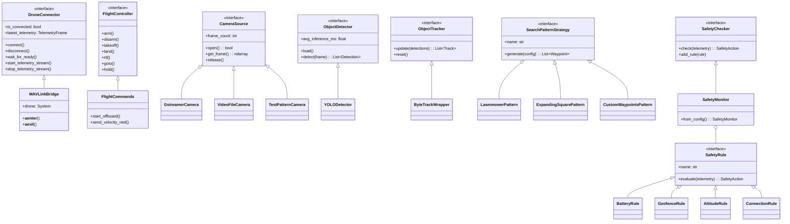
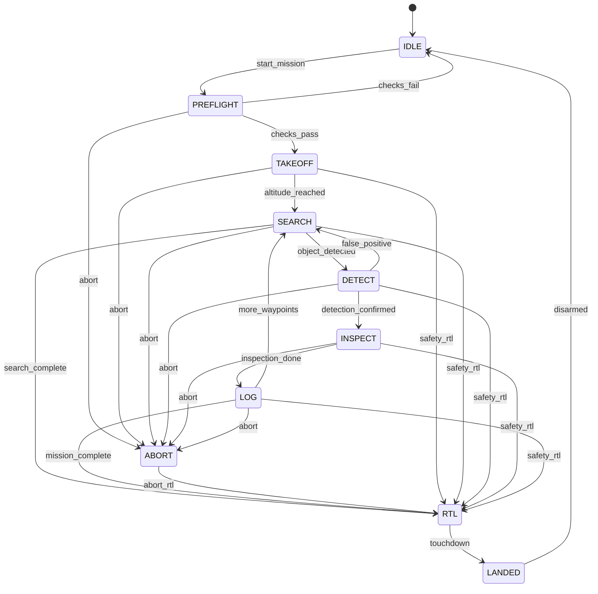
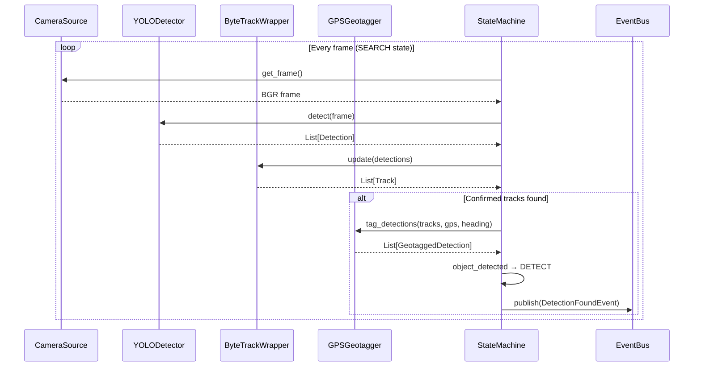
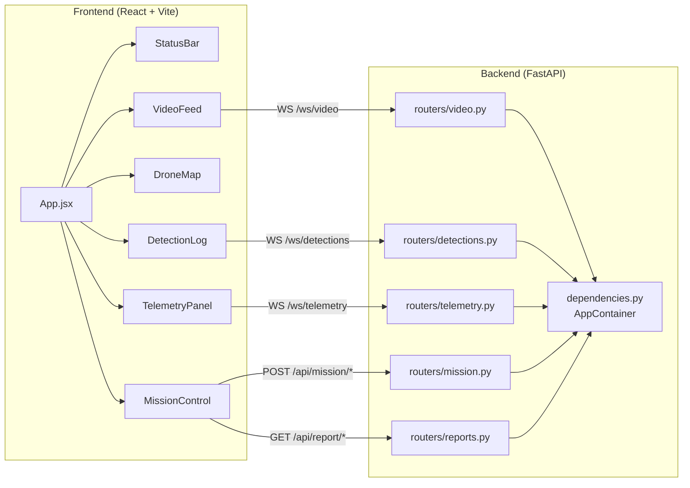

# Architecture — Drone Inspector MVP

## System Overview

The Drone Inspector is a simulation-only autonomous inspection drone system built on **PX4 SITL**, **Gazebo Harmonic**, and **ROS 2 Jazzy**. It demonstrates end-to-end autonomous mission execution with computer vision, from takeoff through waypoint navigation, object detection, and return-to-launch.

The codebase is structured around **SOLID principles**, **OOP best practices**, and **GoF design patterns** to maximize testability, extensibility, and maintainability.

---

## Design Principles Applied

### SOLID Principles

| Principle | Implementation |
|-----------|---------------|
| **SRP** | Each module has one responsibility. State machine owns transitions; `MissionExecutor` owns behavior. Dashboard `main.py` is a thin shell; endpoints live in `routers/`. |
| **OCP** | Search patterns use Strategy pattern — new patterns require only a new class. Safety rules use Chain of Responsibility — new rules are added without editing existing code. |
| **LSP** | Camera implementations (`GstreamerCamera`, `VideoFileCamera`, `TestPatternCamera`) are all substitutable through the `CameraSource` ABC. |
| **ISP** | Interfaces are focused: `ObjectDetector` has only `load()` and `detect()`. `SafetyRule` has only `evaluate()`. No consumer is forced to depend on methods it doesn't use. |
| **DIP** | All consumers depend on abstract interfaces (`DroneConnector`, `FlightController`, `CameraSource`, etc.), never on concrete classes. |

### Design Patterns

| Pattern | Where | Purpose |
|---------|-------|---------|
| **Strategy** | `SearchPatternStrategy` → `LawnmowerPattern`, `ExpandingSquarePattern`, `CustomWaypointsPattern` | Pluggable search patterns without if/elif chains |
| **Observer** | `EventBus` with `TelemetryEvent`, `DetectionFoundEvent`, `StateChangeEvent` | Decoupled pub/sub for telemetry, detections, and state changes |
| **Chain of Responsibility** | `SafetyRule` → `BatteryRule`, `GeofenceRule`, `AltitudeRule`, `ConnectionRule` | Composable safety checks; new rules added by appending |
| **Factory** | `CameraFactory`, `AppFactory`, `SafetyMonitor.from_config()` | Config-driven object construction |
| **State Machine** | `MissionStateMachine` (via `transitions` library) | Declarative state/transition management |
| **Template Method** | `MissionExecutor.do_xxx()` handlers | Consistent state handler contract |
| **Registry** | `PatternRegistry` | Auto-discovery of search pattern strategies |

---

## Module Dependency Graph

```mermaid
graph TB
    subgraph "Core Layer"
        types["core/types.py<br/>DTOs & Enums"]
        interfaces["core/interfaces.py<br/>ABCs"]
        geo["core/geo.py<br/>GPS Math"]
        events["core/events.py<br/>EventBus"]
    end

    subgraph "Bridge Layer"
        bridge["bridge/mavlink_bridge.py<br/>MAVLinkBridge"]
        commands["bridge/commands.py<br/>FlightCommands"]
        telemetry["bridge/telemetry.py<br/>TelemetryCollector"]
    end

    subgraph "Perception Layer"
        camera["perception/camera.py<br/>CameraFactory + 3 impls"]
        detector["perception/detector.py<br/>YOLODetector"]
        tracker["perception/tracker.py<br/>ByteTrackWrapper"]
        geotag["perception/geotagging.py<br/>GPSGeotagger"]
    end

    subgraph "Mission Layer"
        safety["mission/safety.py<br/>SafetyMonitor + Rules"]
        planner["mission/waypoint_planner.py<br/>PatternRegistry"]
        executor["mission/executor.py<br/>MissionExecutor"]
        sm["mission/state_machine.py<br/>MissionStateMachine"]
    end

    subgraph "Dashboard"
        app["dashboard/main.py<br/>FastAPI App"]
        deps["dashboard/dependencies.py<br/>AppContainer"]
        routers["dashboard/routers/<br/>5 router modules"]
    end

    subgraph "Streaming"
        overlay["streaming/overlay.py"]
        video["streaming/video_server.py"]
    end

    factory["factory.py<br/>AppFactory"]

    %% Core dependencies
    bridge --> interfaces
    bridge --> types
    commands --> interfaces
    commands --> bridge
    telemetry --> interfaces
    telemetry --> events

    camera --> interfaces
    detector --> interfaces
    detector --> types
    tracker --> interfaces
    tracker --> types
    geotag --> interfaces
    geotag --> geo

    safety --> interfaces
    safety --> geo
    planner --> interfaces
    planner --> geo
    executor --> interfaces
    executor --> geo
    sm --> executor

    video --> interfaces
    video --> types
    overlay --> types

    app --> factory
    app --> routers
    routers --> deps
    factory --> bridge
    factory --> commands
    factory --> camera
    factory --> detector
    factory --> tracker
    factory --> geotag
    factory --> safety
    factory --> sm
```



---

## Class Hierarchy (UML)



---

## Mission State Machine



---

## Perception Pipeline



---

## Dashboard Architecture



---

## Directory Structure

```
DronePX4/
├── src/
│   ├── core/                    # Foundation layer
│   │   ├── types.py             #   DTOs: Position, TelemetryFrame, Detection, etc.
│   │   ├── interfaces.py        #   ABCs: DroneConnector, FlightController, etc.
│   │   ├── geo.py               #   GPS math: haversine, offset_gps
│   │   └── events.py            #   EventBus (Observer pattern)
│   ├── bridge/                  # PX4 communication
│   │   ├── mavlink_bridge.py    #   DroneConnector impl (MAVSDK)
│   │   ├── commands.py          #   FlightController impl
│   │   └── telemetry.py         #   TelemetryCollector
│   ├── perception/              # Computer vision
│   │   ├── camera.py            #   CameraSource impls + CameraFactory
│   │   ├── detector.py          #   ObjectDetector impl (YOLOv8)
│   │   ├── tracker.py           #   ObjectTracker impl (ByteTrack)
│   │   └── geotagging.py        #   Geotagger impl
│   ├── mission/                 # Autonomy
│   │   ├── state_machine.py     #   MissionStateMachine (transitions)
│   │   ├── executor.py          #   MissionExecutor (state handlers)
│   │   ├── safety.py            #   SafetyMonitor + Rules (CoR)
│   │   └── waypoint_planner.py  #   PatternRegistry + Strategies
│   ├── streaming/               # Video output
│   │   ├── video_server.py      #   WebSocket MJPEG server
│   │   └── overlay.py           #   Detection overlay renderer
│   ├── dashboard/               # Operator UI
│   │   ├── backend/
│   │   │   ├── main.py          #   FastAPI app (slim)
│   │   │   ├── dependencies.py  #   AppContainer (typed DI)
│   │   │   ├── routers/         #   5 endpoint modules
│   │   │   ├── models/          #   Pydantic schemas
│   │   │   └── api/             #   Report generators
│   │   └── frontend/            #   React + Vite
│   ├── factory.py               # AppFactory (central wiring)
│   └── utils/                   # Config & logging
├── tests/unit/                  # 66 unit tests
├── config/                      # YAML config, Gazebo worlds
├── docs/                        # Documentation
├── scripts/                     # Launch & test scripts
└── docker/                      # Docker compose
```

---

## Key Data Flow

1. **Telemetry**: PX4 SITL → MAVSDK → `MAVLinkBridge` → `TelemetryCollector` → `EventBus` → Dashboard WS
2. **Perception**: `CameraSource` → `YOLODetector` → `ByteTrackWrapper` → `GPSGeotagger` → `MissionExecutor`
3. **Commands**: Dashboard → `FlightController` → MAVSDK → PX4 SITL
4. **Safety**: `TelemetryFrame` → `SafetyMonitor` → `[BatteryRule, GeofenceRule, ...]` → `max(actions)` → State Machine

---

## Extending the System

### Add a New Search Pattern
```python
# 1. Create a new strategy class
class SpiralPattern(SearchPatternStrategy):
    @property
    def name(self) -> str: return "spiral"
    def generate(self, config: dict) -> List[Waypoint]: ...

# 2. Register it
PatternRegistry.register(SpiralPattern())
# Done — no existing code changes needed (OCP)
```

### Add a New Safety Rule
```python
# 1. Create a new rule
class WindSpeedRule(SafetyRule):
    @property
    def name(self) -> str: return "wind_speed"
    def evaluate(self, telemetry: TelemetryFrame) -> SafetyAction: ...

# 2. Add to monitor
monitor.add_rule(WindSpeedRule(max_wind_ms=15))
# Done — no existing code changes needed (OCP)
```

### Swap Detector Backend
```python
# Implement the ObjectDetector interface
class TensorRTDetector(ObjectDetector):
    def load(self) -> None: ...
    def detect(self, frame: np.ndarray) -> List[Detection]: ...
    @property
    def avg_inference_ms(self) -> float: ...

# Pass to state machine — no other code changes (DIP)
sm = MissionStateMachine(detector=TensorRTDetector(), ...)
```
