# 📖 Phân Tích Toàn Diện Dự Án Symbotic — Differential-Drive Mobile Robot

## 1. Tổng Quan Dự Án

Dự án **Symbotic** là một hệ thống mô phỏng robot di động sử dụng truyền động vi sai (differential drive) được xây dựng trên nền tảng **ROS 2**. Robot được mô phỏng trong môi trường vật lý **Gazebo Harmonic** với khả năng:

- **Điều khiển bằng bàn phím** (teleoperation) thời gian thực
- **Làm mượt vận tốc** (velocity smoothing) với giới hạn gia tốc/giảm tốc
- **Tự động điều hướng** (Go-to-Goal) tới tọa độ `(x, y)` được chỉ định

> [!NOTE]
> Dự án được thiết kế theo kiến trúc module hóa cao, mỗi package có một trách nhiệm duy nhất, dễ dàng mở rộng mà không cần sửa đổi code hiện có.

---

## 2. Technology Stack

| Thành phần | Công nghệ | Vai trò |
|:---|:---|:---|
| **Robot Framework** | ROS 2 Jazzy Jalisco | Middleware giao tiếp giữa các node, quản lý vòng đời |
| **Physics Simulator** | Gazebo Harmonic (gz-sim) | Mô phỏng vật lý, dynamic, collision |
| **Hệ điều hành** | Ubuntu 24.04 LTS | Nền tảng chạy ROS 2 Jazzy |
| **Ngôn ngữ lập trình** | Python 3 | Viết các node điều khiển (velocity_smoother, go_to_goal) |
| **Mô hình Robot** | URDF / Xacro | Mô tả cấu trúc cơ học của robot (link, joint, inertia) |
| **Drive Plugin** | `gz::sim::systems::DiffDrive` | Plugin trong Gazebo điều khiển 2 bánh vi sai |
| **ROS-Gazebo Bridge** | `ros_gz_bridge` / `ros_gz_sim` | Cầu nối chuyển đổi message giữa ROS 2 ↔ Gazebo |
| **Build System** | `colcon` + `ament_cmake` / `ament_python` | Build workspace ROS 2 |
| **Code Quality** | `flake8`, `pep257`, `ament_copyright` | Kiểm tra coding style, docstring, copyright |

### 2.1. Giải thích từng công nghệ

#### ROS 2 Jazzy Jalisco
- Là phiên bản **LTS (Long Term Support)** của ROS 2, hỗ trợ đến 2029
- Cung cấp hệ thống **publish/subscribe** (Topics), **request/reply** (Services), và **long-running task** (Actions)
- Sử dụng DDS (Data Distribution Service) làm lớp truyền thông bên dưới

#### Gazebo Harmonic
- Thế hệ mới của trình mô phỏng Gazebo (trước đây gọi là Ignition Gazebo)
- Chạy bằng lệnh `gz sim` thay vì `gazebo` như phiên bản Classic
- Cung cấp plugin hệ thống (`DiffDrive`, `JointStatePublisher`) tích hợp trực tiếp vào URDF

#### URDF / Xacro
- **URDF** (Unified Robot Description Format): XML mô tả cấu trúc robot (link, joint, visual, collision, inertia)
- **Xacro**: Macro XML mở rộng cho URDF — cho phép tham số hóa, sử dụng biến, macro, biểu thức toán học

#### colcon + ament
- **colcon**: Build tool chính thức của ROS 2, tương tự `catkin_make` trong ROS 1
- **ament_cmake**: Build type cho C++ package (dùng cho `diff_robot_description`, `diff_robot_bringup`, `diff_robot_msgs`)
- **ament_python**: Build type cho Python package (dùng cho `diff_robot_control`)

---

## 3. Kiến Trúc Hệ Thống

### 3.1. Sơ đồ kiến trúc tổng thể

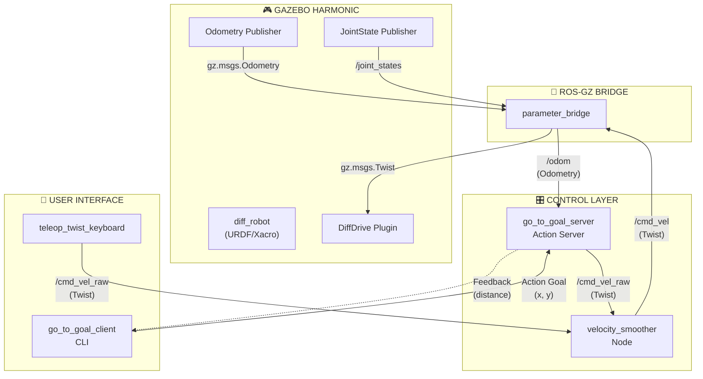

### 3.2. Hệ thống 4 ROS 2 Package

Dự án được tổ chức thành **4 package** độc lập, giao tiếp qua các ROS topic/action chuẩn:

```
src/
├── diff_robot_msgs/          ← Interface definitions (Action)
├── diff_robot_description/   ← Robot URDF model
├── diff_robot_control/       ← Control logic (Python nodes)
└── diff_robot_bringup/       ← Launch files
```

---

## 4. Phân Tích Chi Tiết Từng Package

### 4.1. `diff_robot_msgs` — Custom Interfaces

| Thuộc tính | Giá trị |
|:---|:---|
| **Build type** | `ament_cmake` |
| **Chức năng** | Định nghĩa ROS 2 Action interface |
| **File chính** | [GoToGoal.action](file:///media/tinhtran/01D85BC599D1D460/FreeLancer/Symbotic/src/diff_robot_msgs/action/GoToGoal.action) |

#### Action Definition: `GoToGoal.action`

```
# Goal — Client gửi tọa độ đích
float64 x
float64 y
---
# Result — Server trả về kết quả khi hoàn thành
bool success
---
# Feedback — Server gửi liên tục trong quá trình thực thi
float64 distance_remaining
```

**Cách hoạt động:**
1. Client gửi **Goal** `(x, y)` — tọa độ mà robot cần đến
2. Server liên tục gửi **Feedback** `distance_remaining` — khoảng cách còn lại
3. Khi robot đến nơi, Server gửi **Result** `success = true`

**Build process** ([CMakeLists.txt](file:///media/tinhtran/01D85BC599D1D460/FreeLancer/Symbotic/src/diff_robot_msgs/CMakeLists.txt)):
```cmake
rosidl_generate_interfaces(${PROJECT_NAME}
  "action/GoToGoal.action"
)
```
→ `rosidl_default_generators` tự động sinh ra code Python/C++ tương ứng khi build.

---

### 4.2. `diff_robot_description` — Robot Model

| Thuộc tính | Giá trị |
|:---|:---|
| **Build type** | `ament_cmake` |
| **Chức năng** | Mô tả cấu trúc vật lý của robot |
| **File chính** | [diff_robot.xacro](file:///media/tinhtran/01D85BC599D1D460/FreeLancer/Symbotic/src/diff_robot_description/urdf/diff_robot.xacro) |

#### Cấu trúc Robot

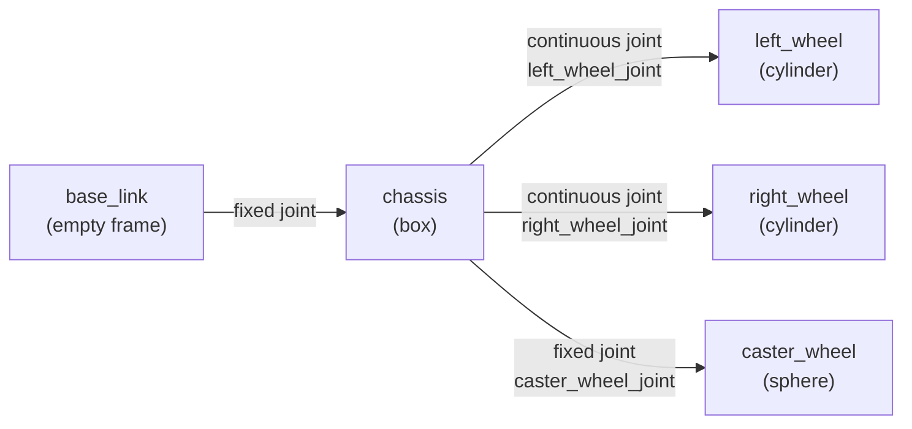

Robot bao gồm **5 link** và **4 joint**:

| Link | Hình dạng | Mô tả |
|:---|:---|:---|
| `base_link` | (trống) | Frame gốc, không có visual/collision |
| `chassis` | Box | Thân robot chính, mặc định 0.4m × 0.3m × 0.1m |
| `left_wheel` | Cylinder | Bánh trái, bán kính 0.1m, dày 0.05m |
| `right_wheel` | Cylinder | Bánh phải, bán kính 0.1m, dày 0.05m |
| `caster_wheel` | Sphere | Bánh hỗ trợ phía trước, bán kính = wheel_radius/2 |

#### Tham số hóa (Xacro Arguments)

Mọi kích thước đều có thể tuỳ chỉnh khi launch mà không cần sửa file URDF:

```xml
<xacro:arg name="chassis_length" default="0.4"/>
<xacro:arg name="chassis_width" default="0.3"/>
<xacro:arg name="wheel_radius" default="0.1"/>
<xacro:arg name="track_width" default="0.35"/>
...
```

#### Xacro Macro — Tái sử dụng code

File sử dụng **3 inertia macro** tính tensor quán tính tự động:

| Macro | Dùng cho | Công thức |
|:---|:---|:---|
| `box_inertia(m, w, l, h)` | Chassis | Ixx = m/12 × (h² + l²), ... |
| `cylinder_inertia(m, r, h)` | Wheel | Ixx = m/12 × (3r² + h²), ... |
| `sphere_inertia(m, r)` | Caster | Ixx = 2/5 × m × r², ... |

Và **1 wheel macro** tạo bánh trái/phải:
```xml
<xacro:macro name="wheel" params="prefix y_reflect x_offset">
  <!-- Tạo link + joint cho một bánh xe -->
</xacro:macro>

<!-- Gọi macro 2 lần -->
<xacro:wheel prefix="left"  y_reflect="1"  x_offset="..."/>
<xacro:wheel prefix="right" y_reflect="-1" x_offset="..."/>
```

#### Gazebo Plugins (nhúng trong URDF)

```xml
<!-- 1. DiffDrive — Điều khiển vi sai -->
<plugin filename="gz-sim-diff-drive-system" name="gz::sim::systems::DiffDrive">
  <left_joint>left_wheel_joint</left_joint>
  <right_joint>right_wheel_joint</right_joint>
  <wheel_separation>$(arg track_width)</wheel_separation>
  <wheel_radius>$(arg wheel_radius)</wheel_radius>
  <odom_publish_frequency>50</odom_publish_frequency>
  <topic>/cmd_vel</topic>        <!-- Nhận lệnh vận tốc -->
  <odom_topic>/odom</odom_topic> <!-- Xuất odometry -->
  <tf_topic>/tf</tf_topic>       <!-- Xuất transform -->
</plugin>

<!-- 2. JointStatePublisher — Publish trạng thái khớp -->
<plugin filename="gz-sim-joint-state-publisher-system" name="gz::sim::systems::JointStatePublisher">
  <topic>/joint_states</topic>
</plugin>
```

> [!IMPORTANT]
> Plugin `DiffDrive` nhận vận tốc tuyến tính + góc từ topic `/cmd_vel` (Twist), sau đó tự tính toán vận tốc từng bánh dựa trên `wheel_separation` và `wheel_radius` theo công thức kinematic vi sai:
> - `v_left = v_linear - (ω × track_width / 2)`
> - `v_right = v_linear + (ω × track_width / 2)`

---

### 4.3. `diff_robot_control` — Control Logic

| Thuộc tính | Giá trị |
|:---|:---|
| **Build type** | `ament_python` |
| **Chức năng** | Chứa các node điều khiển robot |
| **Dependencies** | `rclpy`, `geometry_msgs`, `nav_msgs`, `diff_robot_msgs` |

Package này chứa **3 node** Python:

---

#### 4.3.1. `velocity_smoother` — Làm Mượt Vận Tốc

**File:** [velocity_smoother.py](file:///media/tinhtran/01D85BC599D1D460/FreeLancer/Symbotic/src/diff_robot_control/diff_robot_control/velocity_smoother.py)

**Mục đích:** Đặt giữa nguồn lệnh (bàn phím/go_to_goal) và Gazebo, giới hạn tốc độ thay đổi vận tốc để chuyển động mượt mà.

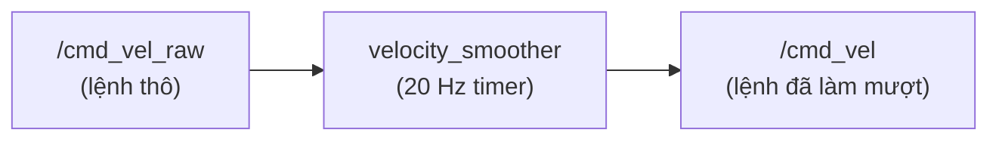

**Tham số nội bộ:**

| Tham số | Giá trị | Ý nghĩa |
|:---|:---|:---|
| `max_accel` | 1.0 m/s² | Đạt 5 m/s trong 5 giây |
| `max_decel` | 5.0 m/s² | Dừng trong 1 giây từ 5 m/s |
| `max_ang_accel` | 2.0 rad/s² | Gia tốc xoay |
| `timer_period` | 0.05s (20 Hz) | Tần suất cập nhật |

**Thuật toán hoạt động:**

```
Mỗi chu kỳ 50ms (20 Hz):
  1. So sánh target_vel (đích) với current_vel (hiện tại)

  2. Vận tốc tuyến tính:
     IF target > current:
       IF current >= 0: dùng max_accel (đang tăng tốc tiến)
       ELSE:            dùng max_decel (đang giảm tốc lùi → để dừng nhanh)
       current = min(current + increment, target)

     IF target < current:
       IF current > 0:  dùng max_decel (đang giảm tốc tiến → để dừng nhanh)
       ELSE:            dùng max_accel (đang tăng tốc lùi)
       current = max(current - increment, target)

  3. Vận tốc góc: tương tự, dùng max_ang_accel

  4. Publish current_vel → /cmd_vel
```

> [!TIP]
> Thiết kế thông minh: khi giảm tốc (muốn dừng) dùng `max_decel = 5.0` — nhanh hơn 5 lần so với tăng tốc. Điều này mô phỏng hành vi robot thực: cần phanh nhanh hơn tăng tốc để đảm bảo an toàn.

---

#### 4.3.2. `go_to_goal_server` — Action Server Điều Hướng

**File:** [go_to_goal_server.py](file:///media/tinhtran/01D85BC599D1D460/FreeLancer/Symbotic/src/diff_robot_control/diff_robot_control/go_to_goal_server.py)

**Mục đích:** Nhận tọa độ đích `(x, y)`, tự động điều hướng robot tới đó bằng bộ điều khiển P (tỉ lệ).

**Kiến trúc nội bộ:**

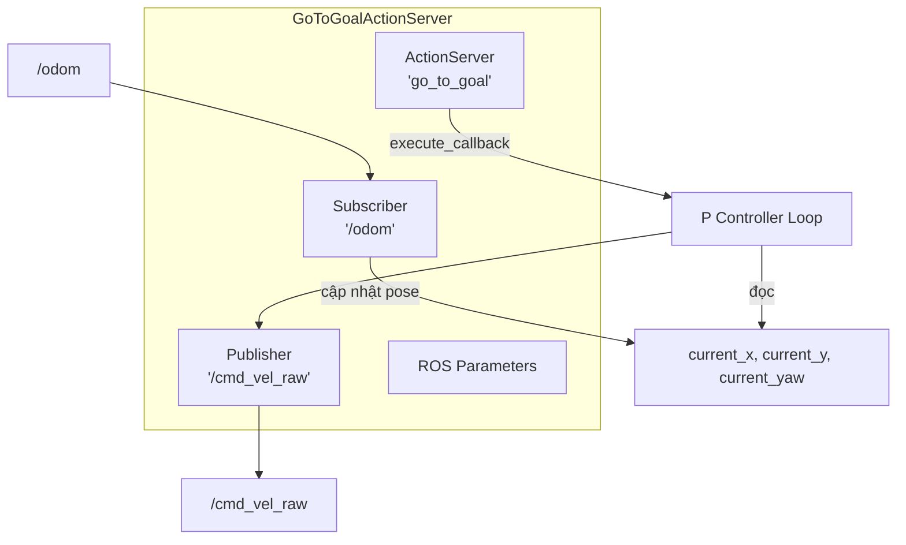

**ROS 2 Parameters (có thể tuỳ chỉnh runtime):**

| Parameter | Default | Ý nghĩa |
|:---|:---|:---|
| `goal_tolerance` | 0.15 m | Khoảng cách coi là "đã đến" |
| `timeout_sec` | 60.0 s | Thời gian tối đa trước khi abort |
| `linear_kp` | 1.0 | Hệ số P cho vận tốc tuyến tính |
| `angular_kp` | 2.0 | Hệ số P cho vận tốc góc |
| `max_linear_speed` | 1.0 m/s | Tốc độ tiến tối đa |
| `yaw_threshold` | 0.1 rad (~5.7°) | Sai lệch heading dưới ngưỡng mới bắt đầu tiến |

**Thuật toán P-Controller chi tiết:**

```
Vòng lặp chính (10 Hz):
  1. Kiểm tra yêu cầu hủy → nếu có, dừng robot, trả result.success = false
  2. Kiểm tra timeout → nếu quá timeout_sec, abort
  3. Đọc pose hiện tại (x, y, yaw) — thread-safe với Lock

  4. Tính toán:
     dx = target_x - current_x
     dy = target_y - current_y
     distance = sqrt(dx² + dy²)

  5. Nếu distance < goal_tolerance → THÀNH CÔNG, dừng robot

  6. Tính heading mong muốn:
     target_yaw = atan2(dy, dx)
     yaw_error  = atan2(sin(target_yaw - current_yaw),
                        cos(target_yaw - current_yaw))
     ↑ Cách normalize góc về khoảng [-π, π]

  7. Quyết định hành động:
     IF |yaw_error| > yaw_threshold:
       → CHỈ XOAY: linear.x = 0, angular.z = angular_kp × yaw_error
       (Xoay tại chỗ cho đến khi hướng về target)

     ELSE:
       → TIẾN + HIỆU CHỈNH HƯỚNG:
         linear.x = min(linear_kp × distance, max_linear_speed)
         angular.z = angular_kp × yaw_error

  8. Publish Twist → /cmd_vel_raw
  9. Gửi Feedback (distance_remaining) cho client
```

> [!IMPORTANT]
> **Tại sao dùng `ReentrantCallbackGroup` và `MultiThreadedExecutor`?**
>
> Trong ROS 2, mặc định callback group là `MutuallyExclusiveCallbackGroup` — chỉ 1 callback chạy tại một thời điểm. Vấn đề: `execute_callback` chạy liên tục trong vòng lặp while → **block** `odom_callback` → robot không cập nhật được vị trí.
>
> Giải pháp: Dùng `ReentrantCallbackGroup` cho phép nhiều callback chạy song song trên các thread khác nhau thông qua `MultiThreadedExecutor`.

**Xử lý quaternion → Euler:**

Hàm [euler_from_quaternion](file:///media/tinhtran/01D85BC599D1D460/FreeLancer/Symbotic/src/diff_robot_control/diff_robot_control/go_to_goal_server.py#L14-L34) chuyển đổi quaternion (x, y, z, w) từ odometry thành góc Euler (roll, pitch, yaw). Chỉ dùng **yaw** (xoay quanh trục z) vì robot di chuyển trên mặt phẳng 2D.

---

#### 4.3.3. `go_to_goal_client` — CLI Action Client

**File:** [go_to_goal_client.py](file:///media/tinhtran/01D85BC599D1D460/FreeLancer/Symbotic/src/diff_robot_control/diff_robot_control/go_to_goal_client.py)

**Mục đích:** Giao diện dòng lệnh cho người dùng gửi tọa độ đích.

**Quy trình hoạt động:**

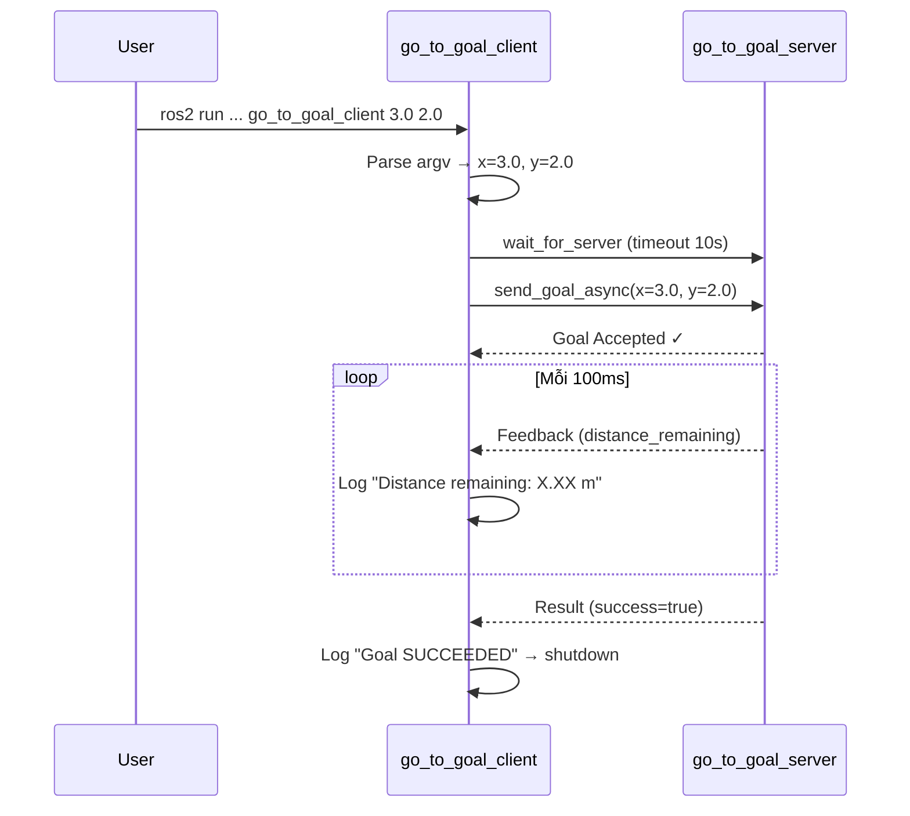

**Xử lý trạng thái kết quả:**

| Status | Ý nghĩa | Hành vi Client |
|:---|:---|:---|
| `STATUS_SUCCEEDED` | Robot đã tới đích | Log info |
| `STATUS_CANCELED` | Người dùng hủy goal | Log warning |
| `STATUS_ABORTED` | Timeout hoặc lỗi | Log error |

---

### 4.4. `diff_robot_bringup` — Launch Files

| Thuộc tính | Giá trị |
|:---|:---|
| **Build type** | `ament_cmake` |
| **Chức năng** | Launch các node, Gazebo, bridge |

#### 4.4.1. `gazebo.launch.py` — Khởi động mô phỏng

**File:** [gazebo.launch.py](file:///media/tinhtran/01D85BC599D1D460/FreeLancer/Symbotic/src/diff_robot_bringup/launch/gazebo.launch.py)

**Khởi chạy 4 thành phần:**

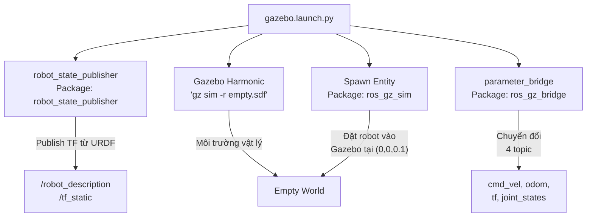

**Chi tiết ROS-Gazebo Bridge (4 topic):**

| ROS 2 Topic | Hướng | Gazebo Topic | Message Type |
|:---|:---|:---|:---|
| `/cmd_vel` | ROS → GZ | `cmd_vel` | `Twist` ↔ `gz.msgs.Twist` |
| `/odom` | GZ → ROS | `odom` | `gz.msgs.Odometry` → `Odometry` |
| `/tf` | GZ → ROS | `tf` | `gz.msgs.Pose_V` → `TFMessage` |
| `/joint_states` | GZ → ROS | `joint_states` | `gz.msgs.Model` → `JointState` |

**Cú pháp bridge:** `topic@ros_msg_type[gz_msg_type` hoặc `]gz_msg_type`
- `]` = ROS → Gazebo (subscribe ROS, publish GZ)
- `[` = Gazebo → ROS (subscribe GZ, publish ROS)

#### 4.4.2. `control.launch.py` — Khởi động các node điều khiển

**File:** [control.launch.py](file:///media/tinhtran/01D85BC599D1D460/FreeLancer/Symbotic/src/diff_robot_bringup/launch/control.launch.py)

Đơn giản khởi chạy 2 node:
- `velocity_smoother` — Làm mượt vận tốc
- `go_to_goal_server` — Action server điều hướng

---

## 5. Luồng Dữ Liệu (Data Flow)

### 5.1. Chế độ Manual (Teleop)

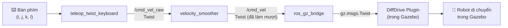

**Ví dụ thực tế:**
1. Nhấn phím `i` → `teleop_twist_keyboard` publish `linear.x = 0.5` lên `/cmd_vel_raw`
2. `velocity_smoother` nhận, nhưng `current_vel = 0.0` → chỉ tăng `0.05 m/s` mỗi chu kỳ (1.0 × 0.05s)
3. Sau 10 chu kỳ (0.5s): `current_vel = 0.5` → đạt target
4. Nhấn `k` (dừng) → target = 0, `velocity_smoother` giảm `0.25 m/s` mỗi chu kỳ (5.0 × 0.05s)
5. Sau 2 chu kỳ (0.1s): robot dừng hẳn

### 5.2. Chế độ Autonomous (Go-to-Goal)

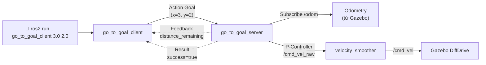

---

## 6. Hệ Thống Giao Tiếp (Communication Patterns)

### 6.1. Tổng quan các Topic

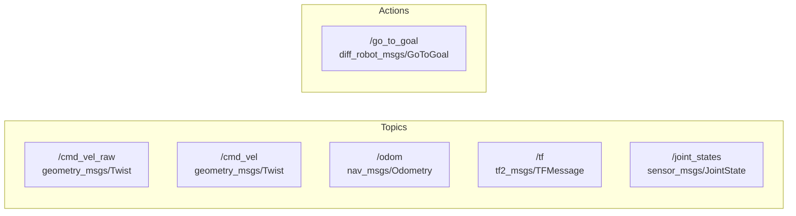

### 6.2. Publisher/Subscriber Map

| Topic | Publisher(s) | Subscriber(s) |
|:---|:---|:---|
| `/cmd_vel_raw` | `teleop_twist_keyboard`, `go_to_goal_server` | `velocity_smoother` |
| `/cmd_vel` | `velocity_smoother` | Gazebo DiffDrive (qua bridge) |
| `/odom` | Gazebo DiffDrive (qua bridge) | `go_to_goal_server` |
| `/tf` | Gazebo DiffDrive (qua bridge) | `robot_state_publisher`, RViz |
| `/joint_states` | Gazebo JointStatePublisher (qua bridge) | `robot_state_publisher` |

### 6.3. Action Server/Client Map

| Action | Server | Client |
|:---|:---|:---|
| `/go_to_goal` | `go_to_goal_server` | `go_to_goal_client` |

---

## 7. Build System & Dependency Graph

### 7.1. Thứ tự build (dependency)

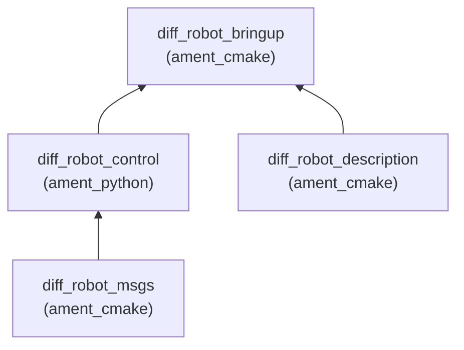

> [!NOTE]
> `colcon build` tự động phát hiện dependency qua `package.xml` và build theo đúng thứ tự. `diff_robot_msgs` luôn được build đầu tiên vì `diff_robot_control` phụ thuộc vào nó.

### 7.2. Entry Points (Python executables)

Định nghĩa trong [setup.py](file:///media/tinhtran/01D85BC599D1D460/FreeLancer/Symbotic/src/diff_robot_control/setup.py#L26-L30):

```python
entry_points={
    'console_scripts': [
        'velocity_smoother = diff_robot_control.velocity_smoother:main',
        'go_to_goal_server = diff_robot_control.go_to_goal_server:main',
        'go_to_goal_client = diff_robot_control.go_to_goal_client:main',
    ],
},
```

Mỗi entry tạo ra 1 executable trong `install/` khi build, cho phép chạy bằng `ros2 run diff_robot_control <tên_node>`.

---

## 8. Quy Trình Chạy Dự Án

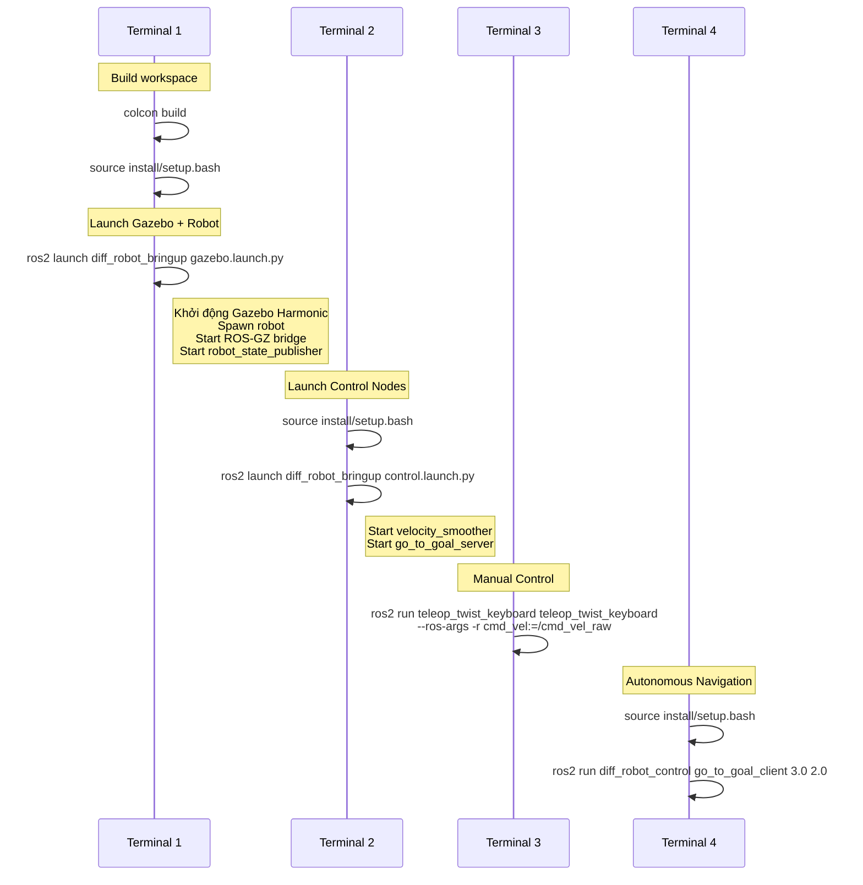

---

## 9. Điểm Thiết Kế Nổi Bật

### 9.1. Hardware-Agnostic Control

`velocity_smoother` và `go_to_goal_server` **không biết** robot đang chạy trong mô phỏng hay phần cứng thực. Chúng chỉ giao tiếp qua ROS topic chuẩn (`/cmd_vel_raw`, `/odom`). Khi chuyển sang robot thật, chỉ cần thay thế lớp Gazebo bằng driver phần cứng.

### 9.2. Topic Remapping Pattern

```
teleop_twist_keyboard → /cmd_vel_raw → velocity_smoother → /cmd_vel → Gazebo
```

Thay vì để `teleop_twist_keyboard` publish trực tiếp lên `/cmd_vel`, dự án **remap** sang `/cmd_vel_raw` để mọi lệnh phải đi qua `velocity_smoother`. Đây là pattern phổ biến trong ROS 2 gọi là **velocity proxy**.

### 9.3. Thread Safety

`go_to_goal_server` sử dụng `threading.Lock()` để bảo vệ dữ liệu pose (`current_x`, `current_y`, `current_yaw`) khi truy cập từ nhiều thread (odom callback vs execute callback).

### 9.4. Goal Validation

Server validate input trước khi accept:
```python
if math.isnan(x) or math.isnan(y) or math.isinf(x) or math.isinf(y):
    return GoalResponse.REJECT
```

---

## 10. Testing

Dự án sử dụng **3 loại test** cho code quality trong package `diff_robot_control`:

| File test | Công cụ | Kiểm tra |
|:---|:---|:---|
| `test_copyright.py` | `ament_copyright` | Kiểm tra header copyright |
| `test_flake8.py` | `flake8` | Linting Python (PEP8, syntax, imports) |
| `test_pep257.py` | `pep257` | Docstring conventions |

Chạy test:
```bash
colcon test --packages-select diff_robot_control
colcon test-result --verbose
```

---

## 11. Tóm Tắt File Map

| File | Ngôn ngữ | Dòng code | Vai trò |
|:---|:---|:---|:---|
| [diff_robot.xacro](file:///media/tinhtran/01D85BC599D1D460/FreeLancer/Symbotic/src/diff_robot_description/urdf/diff_robot.xacro) | XML/Xacro | 160 | Mô hình robot + Gazebo plugins |
| [velocity_smoother.py](file:///media/tinhtran/01D85BC599D1D460/FreeLancer/Symbotic/src/diff_robot_control/diff_robot_control/velocity_smoother.py) | Python | 67 | Làm mượt vận tốc |
| [go_to_goal_server.py](file:///media/tinhtran/01D85BC599D1D460/FreeLancer/Symbotic/src/diff_robot_control/diff_robot_control/go_to_goal_server.py) | Python | 238 | Action server P-controller |
| [go_to_goal_client.py](file:///media/tinhtran/01D85BC599D1D460/FreeLancer/Symbotic/src/diff_robot_control/diff_robot_control/go_to_goal_client.py) | Python | 93 | CLI client gửi goal |
| [gazebo.launch.py](file:///media/tinhtran/01D85BC599D1D460/FreeLancer/Symbotic/src/diff_robot_bringup/launch/gazebo.launch.py) | Python | 72 | Launch Gazebo + bridge |
| [control.launch.py](file:///media/tinhtran/01D85BC599D1D460/FreeLancer/Symbotic/src/diff_robot_bringup/launch/control.launch.py) | Python | 21 | Launch control nodes |
| [GoToGoal.action](file:///media/tinhtran/01D85BC599D1D460/FreeLancer/Symbotic/src/diff_robot_msgs/action/GoToGoal.action) | ROS IDL | 9 | Action interface definition |
| **Tổng cộng** | | **~660** | |

---

## 12. Hướng Mở Rộng

| Mở rộng | Cách thực hiện | Ảnh hưởng |
|:---|:---|:---|
| **Thêm LiDAR** | Thêm link + Gazebo sensor plugin vào Xacro + bridge topic | Không cần sửa control logic |
| **PID Controller** | Thêm integral + derivative vào `go_to_goal_server.py` | Chỉ sửa control law |
| **Nav2 Integration** | Thêm `nav2_bringup` package, dùng `NavigateToPose` action | velocity_smoother vẫn hoạt động |
| **Multi-Robot** | Namespace hóa topic + xacro argument | Spawn nhiều robot độc lập |
| **Sim-to-Real** | Thay Gazebo bằng `ros2_control` + hardware interface | velocity_smoother & go_to_goal **không cần sửa** |
